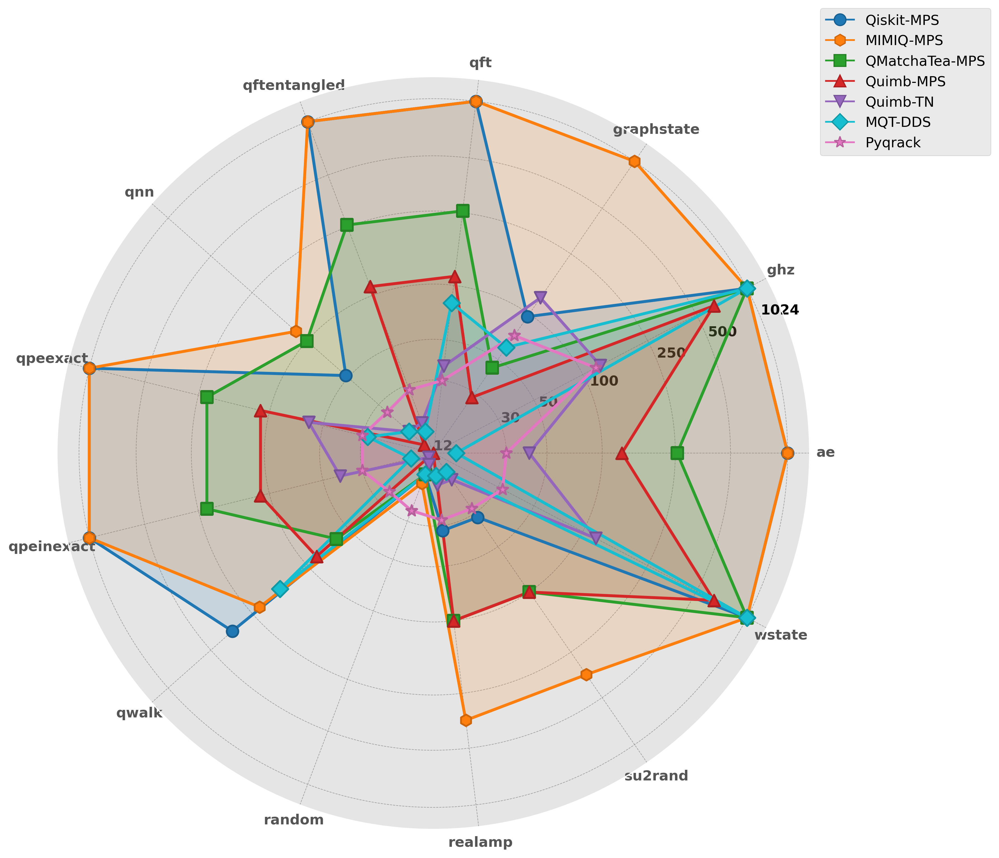
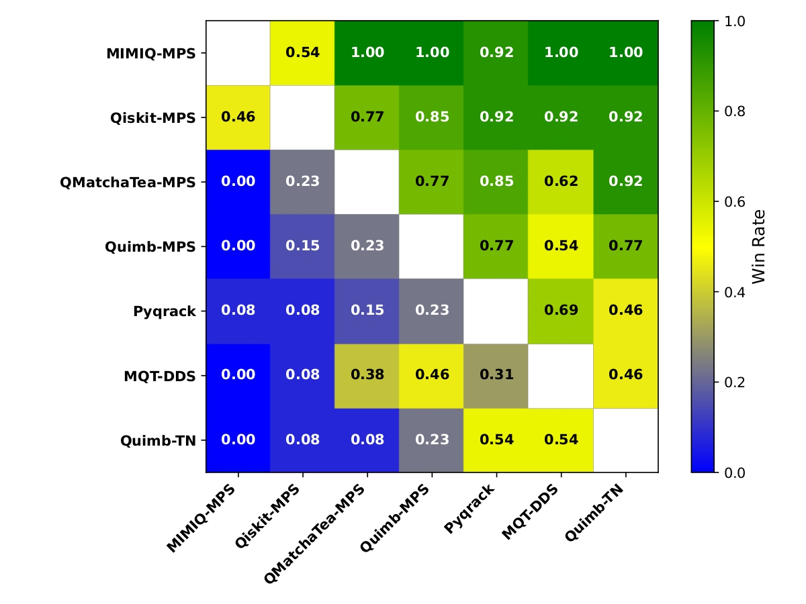
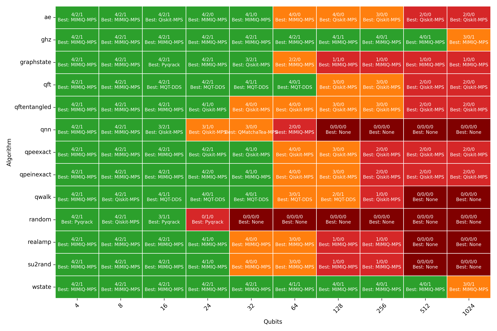

<div style="display: flex; align-items: center; justify-content: space-between;">
  <h1 style="margin: 0;">feniqs_lite: Visualization Tools</h1>
  
</div>

## Table of Contents

- [Overview](#overview)
- [Prerequisites](#prerequisites)
- [Scripts](#scripts)
  - [create-table-from-json.py](#create-table-from-jsonpy)
  - [radar-scalability.py](#radar-scalabilitypy)
  - [plot4panel.py](#plot4panelpy)
  - [heatmap-elo-nt-sim.py](#heatmap-elo-nt-simpy)
  - [heatmap-qc-complexity.py](#heatmap-qc-complexitypy)


## Overview
This folder contains Python scripts for visualizing and analyzing simulator benchmark results.

These scripts were used to generate figures and support the analysis presented in the paper "Comparative Benchmarking of Utility-Scale Quantum Emulators".

## Prerequisites

1. Benchmark Result JSON Files:  

If you have not yet benchmark results in JSON format, they can be downloaded from  https://doi.org/10.5281/zenodo.15212553.

All JSON files must be organized under a common folder structure: all result files should be placed under a top-level folder named, e.g., `results` (default name used in all scripts). 
Within this folder, each simulator should have its own subfolder: 

`qiskit` - Qiskit-MPS 
`mimiq` - MIMIQ-MPS
`qmt` - QMatchaTea-MPS 
`quimb` - Quimb-MPS 
`quimb_nt` - Quimb-TN
`mqt` - MQT-DDS
`pyqrack` - Pyqrack 

Each simulator subfolder must, in turn, contain separate subfolders named after each benchmark circuit (such as `ae`, `ghz`, `qft`, etc.) that store the respective simulation results.

Example of directory structure: 
```
    project-root/ 
    ├── feniqs_tools/ 
        └── visualization/ 
            ├── create-table-from-json.py 
            ├── radar-scalability.py  
            ├── plot4panel.py  
            ├── heatmap-elo-nt-sim.py 
            └── heatmap-qc-complexity.py 
    ├── results/              # Directory containing simulation results 
        ├── qiskit/           # Results from Qiskit-MPS simulator 
            ├── ae/           # Results on `ae` circuit
            ├── ghz/          # Results on `ghz` circuit
            ├── graphstate/   # Results on `graphstate` circuit
            ├── qnn/          # Results on `qnn` circuit
            ├── qft/          # Results on `qft` circuit
            ├── qftentangled/ # Results on `qftentangled` circuit
            ├── qwalk/        # Results on `qwalk` circuit
            ├── qpeexact/     # Results on `qpeexact` circuit
            ├── qpeinexact/   # Results on `qpeinexact` circuit
            ├── random/       # Results on `random` circuit
            ├── realamp/      # Results on `realamp` circuit
            └── su2rand/      # Results on `su2rand` circuit
        ├── qmt/              # Results from QMatchaTea-MPS simulator 
            ├── ae/           # Results on `ae` circuit
            ├── ghz/          # Results on `ghz` circuit
            ├── graphstate/   # Results on `graphstate` circuit
            .....
        ├── mqt/              # Results from MQT-DDS simulator 
        ├── quimb/            # Results from Quimb-MPS simulator 
        ├── quimb_nt/         # Results from Quimb-TN simulator 
        ├── mimiq/            # Results from MIMIQ-MPS simulator 
        └── pyqrack/          # Results from Pyqrack simulator 
    ├── feniqs_daemon/ 
        └── main.py           # Main benchmark script - run if you need new JSON 
    └── fig/                  # Directory where generated PDFs by plot4panel.py will be saved
```
**Attention**: Make sure you have the benchmark results in JSON files correctly placed.


2. Required Python libraries include: `os`, `glob`, `json`, `numpy`, `pandas`, `matplotlib`, and `seaborn`.

**Attention**:  Make sure you have these libraries installed.
  
## Scripts
### `create-table-from-json.py` 

This script generates a table summarizing the maximum number of qubits achieved by each simulator for every benchmark circuit. 
It leverages simulation results stored in JSON files to compile and display this scalability metric.

#### Overview
The code iterates through a list of benchmark tasks and, for each simulator, searches the corresponding results directory for JSON files. 
It extracts the number of qubits and fidelity from each file and, if the fidelity is at least 0.99, uses the number of qubits to determine the best (maximum) performance. The final results are aggregated into a CSV file named `benchmark_max_qubits.csv`.


#### Configuration
- `simulator_task_dirs`:  
  Update the paths in this dictionary to point to the correct result directories for each simulator. If you add a new simulator, add its name and path accordingly.
- `benchmark_tasks`:  
  Modify the list to include any new benchmark circuits or to exclude ones that are not relevant.

#### Output
- CSV File: `benchmark_max_qubits.csv`
  The script saves a table of results to a file named `benchmark_max_qubits.csv`. This table contains one row per benchmark circuit (identified by the "alg" field) and one column for each simulator. The table shows the maximum number of qubits achieved (for files with fidelity ≥ 0.99).
  **Attention:**  the file `benchmark_max_qubits.csv` is needed for `radar-scalability.py` script.

#### Usage
1. Update Configurations:  
   If needed, edit the `simulator_task_dirs` and `benchmark_tasks` variables in the script to match your local file system and benchmark setup.

2. Run the Script:  
   Execute the script:
   ```bash
   python feniqs_tools/visualization/create-table-from-json.py
   ```

### `radar-scalability.py` 

This code generates a radar chart to visualize scalability performance of various quantum simulators, such as Qiskit-MPS, QMatchaTea-MPS, MQT-DDS, Quimb-MPS, Quimb-TN, MIMIQ-MPS, and Pyqrack.

  
#### Overview
This code creates a radar chart by doing the following steps:
- Reads benchmark data from `benchmark_max_qubits.csv`.
- Maps each algorithm to a specific angle.
- Plots performance metrics for each simulator with filled polygons and connecting lines.
- Uses custom colors and markers for each emulator; edge colors are created using a color-darkening function.
- Uses symmetrical logarithmic scale (linear near zero, logarithmic beyond).
- Adopts a visual style from available options (`seaborn-whitegrid`, `ggplot`, or default).

#### Output:  
  The final radar chart is saved as `radar_chart.png` with a resolution of 300 DPI.
  

#### Usage
1. Ensure the benchmark CSV file (`benchmark_max_qubits.csv`) is present in the working directory.
   If not, generate it, using `create-table-from-json.py`.
   In `benchmark_max_qubits.csv`, the first columns contain an algorithm name, followed by columns for different simulators (e.g., "Qiskit_MPS", "MIMIQ_MPS", etc.).
2. Run script 
   ```bash
   python feniqs_tools/visualization/radar-scalability.py
   ```

### `plot4panel.py` 

#### Overview

This code generates Line Charts for visualizing Run time vs Qubits and performs the following functions:

- Data Processing:  
  The script maps each simulator to its corresponding base directory (see description above) and constructs subdirectory paths for specific simulation tasks. It iterates through all available JSON files to extract key performance metrics:
  - Number of Qubits (nb_qubits): The size of the quantum system simulated.
  - Fidelity (median_rt): Used to filter out low-quality data, only entries with a fidelity of at least 0.99 are retained.
  - Runtime (min_rt): The minimum run time.
  Valid data points containing the run time, qubits, simulator label, and task name are then stored in a DataFrame for subsequent analysis.

- Visualization:  
  The script generates detailed log–log plots to illustrate the relationship between run time and the number of qubits:
  - Individual Task Plots (13 plots - each plot - one task): For each simulation task, the script creates plots showing run time versus qubits, adds reference lines for linear and quadratic trends, and saves each plot as a PDF in the designated output directory - `fig/`.
  - Combined Four-Panel Plot: A selected subset of tasks is presented side by side in a four-panel figure with a common legend, enabling a comparative view of the simulators’ performance across multiple tasks. Selected tasks: "wstate" - easy, "realamp" - medium, "qnn" - hard and "random" - very hard.

#### Configuration
- `simulator_task_dirs`:  
  Update the paths in this dictionary to point to the correct result directories for each simulator. If you add a new simulator, add its name and path accordingly.
- `tasks`:  
  Modify the list to include any new benchmark circuits or to exclude ones that are not relevant.

#### Output
- Generated Plots:  
  - Individual Task Plots - Run Time vs. Number of Qubits: Each simulation task yields a separate PDF file containing the corresponding log–log plot.
  

  - Combined Four-Panel Plot: A single PDF file aggregates four selected task plots into one multi-panel figure for comparative analysis.
   


  
  All PDF files are saved in the designated output directory (`fig/`).

- Console Output:  
  - The script prints warning messages if expected directories are missing.
  - Error messages are logged for any JSON files that cannot be processed.

#### Usage
1. Ensure that all benchmark results JSON files are presented and corretly placed.
   If not, place them as it described in `Prerequisites` section.
2. Run script 
   ```bash
   python feniqs_tools/visualization/plot4panel.py
   ```

###  `heatmap-elo-nt-sim.py` 

#### Overview
This code generates an Elo ranking metric to assess and compare the aggregated performance of various quantum simulators on a set of benchmark circuits. The script aggregates achieved maximum number of qubits, run time and fidelity metrics from JSON files by simulator and benchmark, computes Elo ratings through pairwise comparisons, and generates a win rate heatmap that visually represents the performance relationships between simulators.

- Data Processing:  
  The script maps each simulator to its corresponding base directory (see description above) and constructs subdirectory paths for specific simulation tasks. It iterates through all available JSON files to extract key performance metrics:
  - Fidelity (median_rt): Used to filter out low-quality data, only entries with a fidelity of at least 0.99 are retained.
  - Runtime (min_rt): The minimum run time.
  - Number of Qubits (nb_qubits).
  For each simulator and benchmark task, if the extracted results meet the quality criteria (fidelity ≥ 0.99 and runtime ≤ 300), the valid runtime is recorded; otherwise, a penalty value of 1000 is assigned. Important - only the result corresponding to the highest candidate dimension is kept.

- Performance Comparison:  
  The script compares performance between simulators using tuples of (candidate dimension, runtime) with the following rules:
  - The simulator achieving a higher candidate dimension is deemed superior.
  - In the event of equal candidate dimensions, the lower runtime wins.
  - If both metrics are identical, the matchup is skipped.

- Elo Ranking Simulation:  
  The Elo simulation involves repeated pairwise comparisons across all benchmarks. Key aspects include:
  - Initializing all simulator ratings to 1200.
  - Updating ratings based on pairwise comparisons using the standard Elo rating formula with a configurable update factor.
  - Aggregating ratings over multiple trials, recording the evolution of ratings, and calculating the average and standard deviation for each simulator.
  
#### Configuration
- `simulator_task_dirs`:  
  Update the paths in this dictionary to point to the correct result directories for each simulator. If you add a new simulator, add its name and path accordingly.
- `tasks`:  
  Modify the list to include any new benchmark circuits or to exclude ones that are not relevant.

#### Output
- Elo Ratings Table:  
  This table (sorted by average rating) summarizes the Elo metric of all simulators.

- Pairwise Win Rate Heatmap:
  A heatmap representing the pairwise win rates among the simulators. This heatmap is reordered according to the Elo rankings and saved as a PDF file (`elo_heatmap.pdf`). 

  
  


#### Usage
1. Ensure that all benchmark results JSON files are presented and corretly placed.
   If not, place them as it described in `Prerequisites` section.
2. Run script 
   ```bash
   python feniqs_tools/visualization/heatmap-elo-nt-sim.py
   ```

### `heatmap-qc-complexity.py` 

#### Overview
This code  generates a heatmap that visually summarizes the complexity of solving different benchmark tasks. The complexity for each (Algorithm, Qubit) combination is derived from runtime and fidelity data collected from JSON result files. The heatmap categorizes each case into one of four levels: Easy, Medium, Hard, or Very Hard, and annotates the best-performing simulator based on runtime.


- Data Processing:  
  - For each simulation run, key metrics such as the number of qubits, runtime (`min_rt`), and fidelity (`median_rt`) are extracted from JSON.  
    Results are flagged as "Solved" if they meet the criteria of runtime below 300 seconds and fidelity at or above 0.99.  
  - Simulators are grouped into predefined categories (e.g., MPS, NT, DDS) based on their characteristics.  
  - For each (Algorithm, Qubit) combination:
    - The number of simulators that successfully solved the task is counted per category.
    - The best-performing simulator (with the minimum runtime) is identified.
    - A "Solved Rate" is computed to determine the difficulty level.
    - Complexity is categorized as "Easy", "Medium", "Hard", or "Very Hard" based on thresholds of the solved rate.

- Data Visualization:
  - A heatmap is generated with a custom color palette mapped to the complexity categories.  
  - The heatmap displays the complexity per benchmark algorithm against the number of qubits, and annotations detail solver counts and the best-performing simulator.

#### Output 
  The generated heatmap saved as `complexity_heatmap.png`.


#### Usage
1. Ensure that all benchmark results JSON files are presented and corretly placed.
   If not, place them as it described in `Prerequisites` section.
2. Run script 
   ```bash
   python feniqs_tools/visualization/heatmap-qc-complexity.py
   ```

#### Additional Notes
- The qubit values for the "qwalk" benchmark are normalized using the custom `normalize_qwalk` function to account for additional ancilla.


